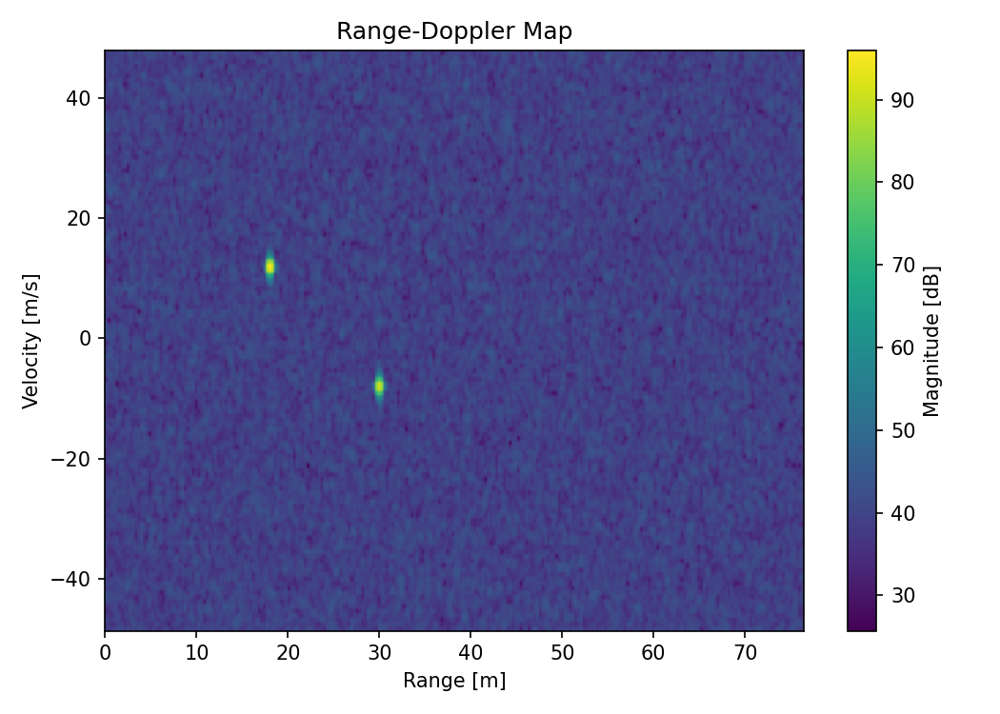
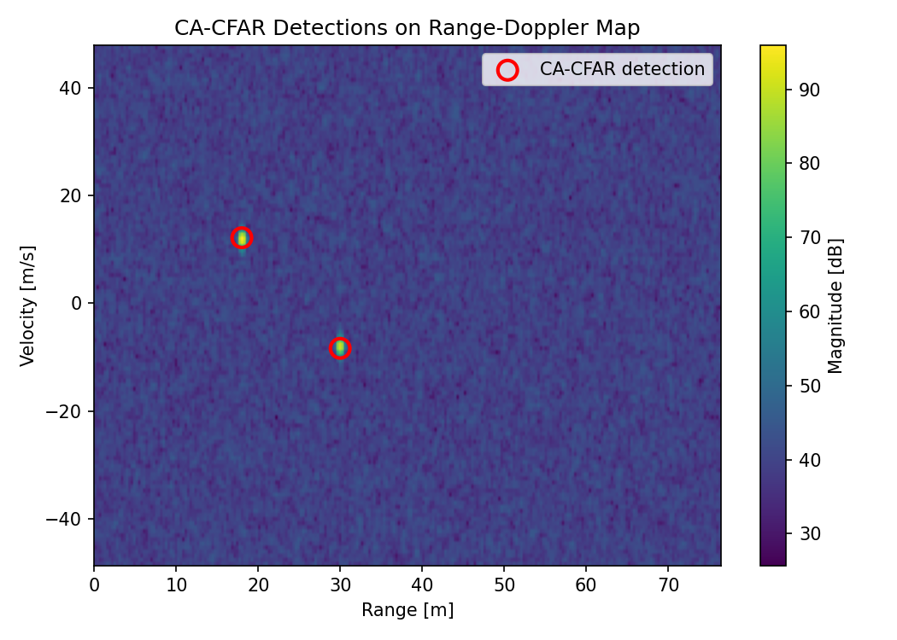
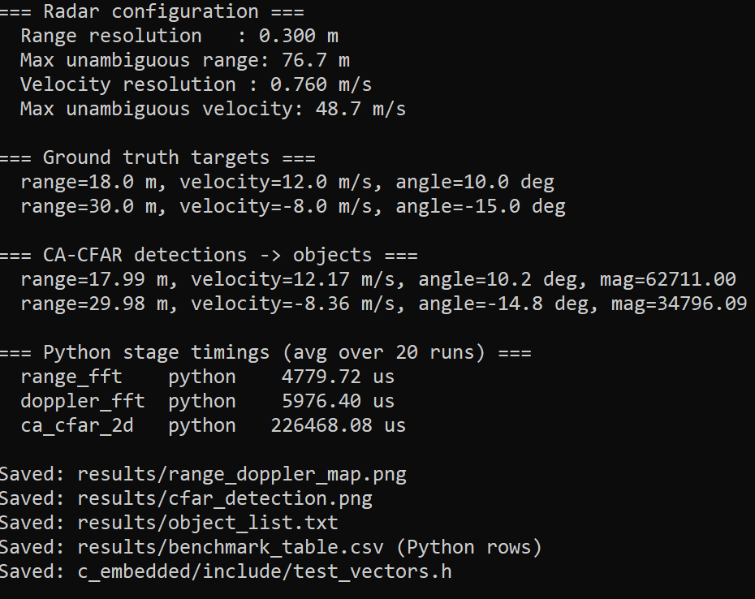
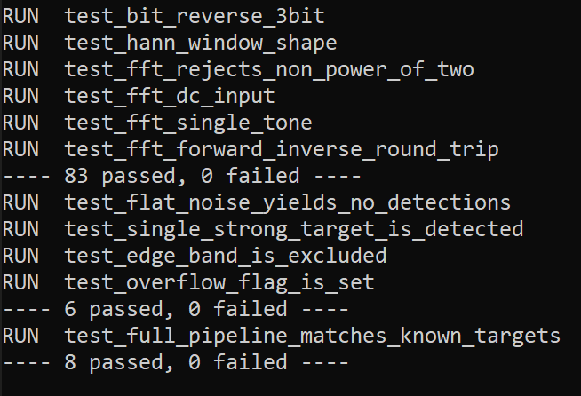

# Automotive Radar DSP Pipeline: Python Prototyping to Embedded C

A complete FMCW automotive radar signal-processing pipeline, built twice:
once in Python for algorithm design and validation, once in dependency-free
embedded C for the target platform -- with both validated against each
other on identical input data, and benchmarked against each other on
identical algorithms.

Part of a broader radar perception pipeline that also includes a separate
radar-camera fusion project -- this piece is the front-end signal
processing stage: turning raw FMCW ADC samples into a validated,
benchmarked range/velocity/angle object list, in both Python and embedded
C, ready to feed into a tracker or fusion layer downstream.

## Pipeline

```
simulated raw IQ cube  -->  range FFT  -->  Doppler FFT  -->  CA-CFAR  -->  clustering  -->  angle estimation  -->  object list
   (synthetic FMCW)         (fast-time)     (slow-time)    (detection)   (non-max suppr.)    (Python only)
```

Both implementations run this chain (the C side omits angle estimation by
design -- see [`docs/radar_dsp_pipeline.md`](docs/radar_dsp_pipeline.md)).
Full explanation of the radar physics and each stage's algorithm is in
that doc.

## Results

### Range-Doppler map

Two synthetic targets clearly resolved: 18 m / +12 m/s and 30 m / -8 m/s.



### CA-CFAR detections

Both targets detected with no false alarms. Red circles mark the CFAR
detection after non-max suppression clustering.



### End-to-end validation output

```
=== Radar configuration ===
  Range resolution   : 0.300 m
  Max unambiguous range: 76.7 m
  Velocity resolution : 0.760 m/s
  Max unambiguous velocity: 48.7 m/s

=== Ground truth targets ===
  range=18.0 m, velocity=12.0 m/s, angle=10.0 deg
  range=30.0 m, velocity=-8.0 m/s, angle=-15.0 deg

=== CA-CFAR detections -> objects ===
  range=17.99 m, velocity=12.17 m/s, angle=10.2 deg, mag=62711.00
  range=29.98 m, velocity=-8.36 m/s, angle=-14.8 deg, mag=34796.09
```

<p align="center">
 
</p>

Detection error: range within 0.02 m, velocity within 0.37 m/s -- well
inside one range/velocity bin.

### C test suite

97 checks, 0 failures across three standalone test binaries:

```
RUN  test_bit_reverse_3bit
RUN  test_hann_window_shape
RUN  test_fft_rejects_non_power_of_two
RUN  test_fft_dc_input
RUN  test_fft_single_tone
RUN  test_fft_forward_inverse_round_trip
---- 83 passed, 0 failed ----
RUN  test_flat_noise_yields_no_detections
RUN  test_single_strong_target_is_detected
RUN  test_edge_band_is_excluded
RUN  test_overflow_flag_is_set
---- 6 passed, 0 failed ----
RUN  test_full_pipeline_matches_known_targets
---- 8 passed, 0 failed ----
```
<p align="center">
 
</p>

## Repository layout

```
automotive-radar-dsp-embedded-c/
├── python_model/          Algorithm design & validation (numpy/matplotlib)
│   ├── generate_fmcw_data.py   FMCW radar raw-data simulator
│   ├── range_fft.py            Stage 1: fast-time FFT
│   ├── doppler_fft.py          Stage 2: slow-time FFT + non-coherent integration
│   ├── cfar.py                 Stage 3: CA-CFAR detection + clustering
│   ├── angle_estimation.py     Stage 4: angle-of-arrival via spatial FFT
│   └── radar_pipeline_demo.py  End-to-end demo; generates results/ and test_vectors.h
│
├── c_embedded/             Embedded C port (no malloc, no OS, no external deps)
│   ├── include/                 Shared headers + auto-generated test_vectors.h
│   ├── src/                     fft_core, range_fft, doppler_fft, cfar_ca, radar_pipeline, benchmark
│   └── tests/                   Standalone unit + integration test binaries
│
├── docs/
│   ├── radar_dsp_pipeline.md       Full pipeline explanation
│   ├── embedded_architecture.md    Embedded design decisions + a real bug fixed
│   └── performance_benchmark.md    Python vs. C methodology and results
│
├── results/                Generated plots, object list, benchmark CSV
└── CMakeLists.txt
```

## Building and running

### Python model

Run from the **project root** (not from inside `python_model/`):

```bash
# Windows (Anaconda Prompt)
conda activate radar
python python_model\radar_pipeline_demo.py

# Linux / macOS
cd python_model
pip install numpy scipy matplotlib
python3 radar_pipeline_demo.py
```

Prints the detected objects and Python-side stage timings, and writes
`results/range_doppler_map.png`, `results/cfar_detection.png`,
`results/object_list.txt`, `results/benchmark_table.csv`, and
`c_embedded/include/test_vectors.h`.

### C pipeline and tests

```bash
mkdir build && cd build
cmake ..
cmake --build .
./radar_pipeline       # runs the same scene as the Python demo, prints detections
./benchmark             # appends C-side timings to results/benchmark_table.csv
ctest                   # runs test_fft, test_cfar, test_pipeline
```

### Windows (MSVC)

From an **x64 Native Tools Command Prompt for VS**:

```bat
cd c_embedded

:: Build and run the pipeline
cl /O2 /std:c17 /I include src\fft_core.c src\range_fft.c src\doppler_fft.c src\cfar_ca.c src\radar_pipeline.c /Fe:radar_pipeline.exe
radar_pipeline.exe

:: Build and run the benchmark (appends C timings to benchmark_table.csv)
cl /O2 /std:c17 /I include src\fft_core.c src\range_fft.c src\doppler_fft.c src\cfar_ca.c src\benchmark.c /Fe:benchmark.exe
benchmark.exe

:: Build and run the tests
cl /O2 /std:c17 /I include /I tests src\fft_core.c tests\test_fft.c /Fe:test_fft.exe
cl /O2 /std:c17 /I include /I tests src\cfar_ca.c tests\test_cfar.c /Fe:test_cfar.exe
cl /O2 /std:c17 /I include /I tests src\fft_core.c src\range_fft.c src\doppler_fft.c src\cfar_ca.c tests\test_pipeline.c /Fe:test_pipeline.exe
test_fft.exe
test_cfar.exe
test_pipeline.exe
```

`/std:c17` requires Visual Studio 2019 16.8+. MSVC links the math library
automatically -- no `/link libm` needed.

## Validation

The C pipeline is checked against the Python reference model on identical
input, not just against itself:

- `c_embedded/include/test_vectors.h` is exported directly from the Python
  model's exact synthetic scene.
- `c_embedded/tests/test_pipeline.c` asserts the C output matches the same
  two ground-truth targets the Python script reports.
- Running both produces near-identical detections: range within 0.02 m,
  velocity within 0.37 m/s, magnitude matching to 3 significant figures.

## Performance

Measured on Windows 10, Intel x64, MSVC 19.50 (`/O2`) vs. Python 3.12
(Anaconda). Both sides run the identical algorithm on the identical input
-- the speedup isolates compiled C vs. interpreted Python, not a smarter
algorithm on one side.

| Stage | Python | C (MSVC /O2) | Speedup |
|---|---|---|---|
| Range FFT | 4.78 ms | 0.70 ms | **6.8x** |
| Doppler FFT | 5.98 ms | 0.78 ms | **7.7x** |
| CA-CFAR | 226.47 ms | 22.34 ms | **10.1x** |

The FFT speedups here (~7x) are larger than on the Linux development
sandbox (~2-3x) because MSVC's `/O2` is being compared against Anaconda
Python on Windows, where numpy's FFT carries more overhead than on a bare
Linux install. The CA-CFAR speedup (~10x) is the most platform-stable and
most meaningful number: both sides use the same nested-loop algorithm with
no numpy shortcut available to Python, so it is a direct measurement of
interpreted vs. compiled performance on exactly the same work.

Full methodology and the twiddle-factor optimization story:
[`docs/performance_benchmark.md`](docs/performance_benchmark.md).

## Notable design decisions

- **No dynamic memory anywhere in `c_embedded/`** -- every buffer is a
  fixed-size static/stack array, matching how most automotive radar
  MCU/DSP targets handle the signal-processing task.
- **A real bug, found and fixed**: an early, too-small CFAR detection
  buffer silently dropped a true-peak detection. Full write-up, the fix,
  and the regression test that now guards against it:
  [`docs/embedded_architecture.md`](docs/embedded_architecture.md).
- **One antenna resident in RAM at a time** during multi-antenna
  non-coherent integration, rather than holding every antenna's full chirp
  matrix simultaneously.
